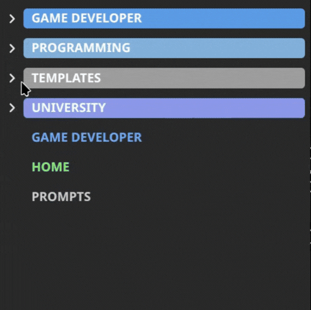
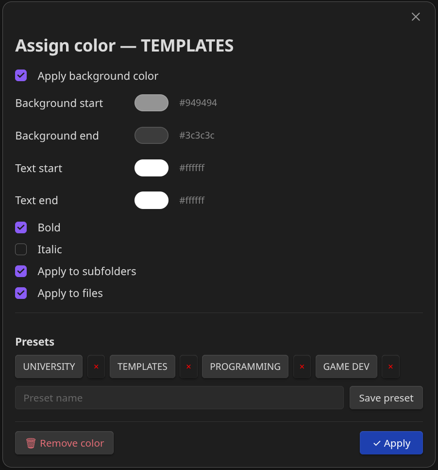

# Folder Color — Obsidian Plugin

Colorize your file explorer with **gradient colors** that cascade through subfolders and files — all without touching a single line of CSS.

  

---

## Features

- **Gradient coloring** — set a start and end color; the gradient is applied automatically across all subfolders by depth.
- **Cascades to files** — files inside a colored folder match the color of their direct parent.
- **Non-markdown file tags** — `.pdf`, `.canvas`, `.excalidraw` and other files get a split-pill style that includes a file-extension badge.

---

## How to use

### Assign a color to a folder

1. **Right-click** any folder in the file explorer.
2. Select **Assign color**.
3. Configure the gradient start and end colors, text colors, and any style options.
4. Click **✓ Apply**.

### Assign a color to a file

Same steps as above, but right-click a **file** instead. Files use a single color (no gradient).

---

## Settings

Open **Settings → Folder Color** to access:

| Option | Description |
|---|---|
| **Export configuration** | Downloads all your folder/file colors and presets as a `folder-color-config.json` file. |
| **Import configuration** | Loads a previously exported JSON file and applies it immediately. |
| **Presets** | Lists all saved presets with a color preview. You can delete them from here. |

## Support

If you want to support me, you can buy me a coffee on Ko-fi.

---

## License

See [LICENSE](LICENSE) for more information.
